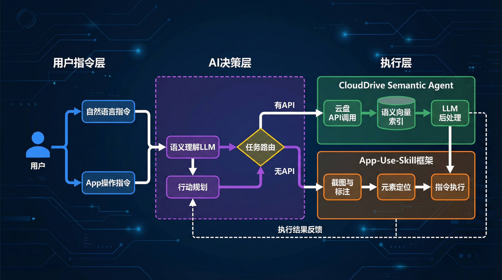
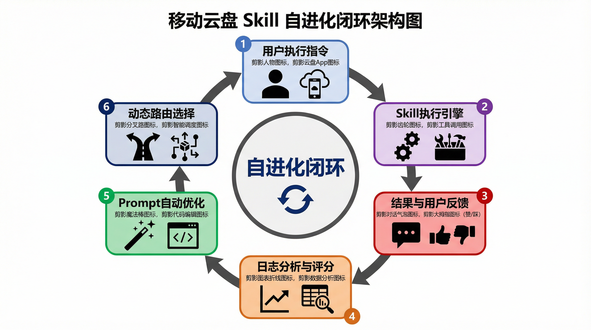

# 移动云盘 App 与 AI Agent 深度绑定方案

**作者**: Damon Li
**日期**: 2026-03-13

## 1. 调研背景：从“文件存储”到“内容理解”

当前，ClawHub 上的云盘类 Skills（如 Google Drive, Dropbox）大多停留在“文件操作”层面，仅能执行上传、下载、搜索等基础指令。这导致 AI Agent 无法真正理解和利用云盘中的海量知识。为了打破这一瓶颈，我们必须将云盘从一个被动的“网络U盘”升级为一个主动的“智能知识库”。

本报告提出了两大创新方案，旨在实现 AI Agent 与移动云盘 App 的深度绑定：

1.  **`CloudDrive-Semantic-Agent` Skill**: 一个专为移动云盘设计的语义理解型 Skill。
2.  **`App-Use-Skill` 框架**: 一个通用的“App 操作代理层”框架，让 Agent 能够操作任何移动 App。

## 2. 方案一：`CloudDrive-Semantic-Agent` Skill

### 2.1 核心思想

本 Skill 的核心是“**API 调用 + LLM 后处理**”的混合模式。它将云盘 API 返回的结构化数据（文件列表）和非结构化数据（文件内容）喂给大语言模型（LLM），进行深度的语义理解和决策。

### 2.2 核心能力

-   **语义文件搜索**: 理解“帮我找上周关于电网安全的会议纪要PPT”等模糊指令。
-   **智能文件整理**: 执行“把‘项目A’文件夹里所有的合同，按签订日期归档”等复杂操作。
-   **跨文档内容问答**: 实现“对比一下‘合同A’和‘合同B’在违约条款上的主要区别”等高级分析。

[查看详细 SKILL.md 设计](./skill_templates/clouddrive_semantic_agent/SKILL.md)

## 3. 方案二：`App-Use-Skill` 框架

### 3.1 核心思想

在大量 App 没有提供 API 的现实情况下，`App-Use-Skill` 框架通过“**视觉语言模型 (VLM) + UI 自动化**”的模式，赋予 Agent 直接操作 App 界面的能力。

### 3.2 工作流程

1.  **截图与标注**: Agent 获取 App 截图，VLM 识别所有可交互元素。
2.  **指令理解**: Agent 理解用户的自然语言指令。
3.  **行动规划**: Agent 将指令与截图元素匹配，规划操作步骤。
4.  **指令执行**: Agent 调用底层自动化框架（如 Appium）执行操作。

### 3.3 应用场景

-   **自动登录与分享**: 自动填充表单，找到“分享”按钮并发送给指定联系人。
-   **跨应用工作流**: 实现“把微信里收到的文件，自动存到移动云盘的‘待处理’文件夹”等复杂流程。

[查看详细 SKILL.md 设计](./skill_templates/app_use_skill/SKILL.md)

## 4. 架构图

### 4.1 App-Use-Skill 整体架构

### 4.2 Skill 自进化闭环

## 5. 总结与展望

`CloudDrive-Semantic-Agent` Skill 解决了“内容理解”的问题，而 `App-Use-Skill` 框架则打破了“应用孤岛”的壁垒。二者结合，将使 AI Agent 成为一个真正贯穿所有数据和应用的“超级助理”，为移动办公带来革命性的体验。
