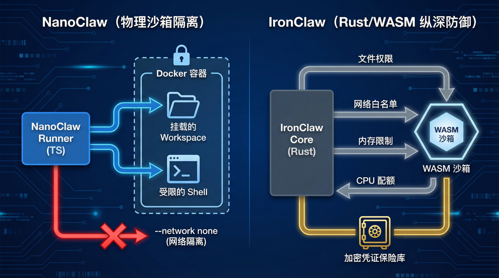
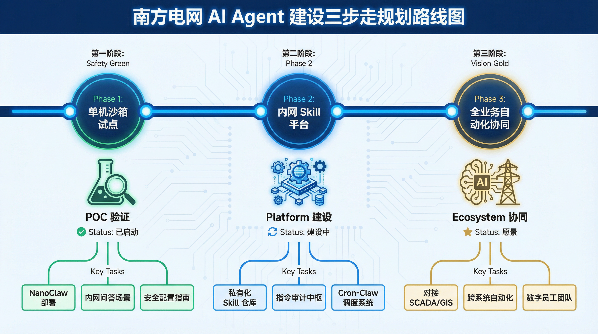

# OpenClaw 在电力内网部署的深度调研与方案建议 (干货版)

## 摘要

本报告针对电力行业客户在内网环境下部署 AI Agent 框架（特别是 OpenClaw 及其替代方案）所关心的核心技术问题、安全考量、国产化适配及资源优化等议题，进行了全面深入的调研与分析。本报告旨在为客户提供清晰的技术洞察、风险评估及可行的部署策略，以支撑其在电网智能化转型中的决策。

## 1. 核心问题提炼与调研概览

客户提出的问题集中在 OpenClaw 的架构优势、内网隔离下的能力边界、Skill 生态构建、国产化替代方案（NanoClaw）、安全加固（IronClaw 与 OpenClaw 最新版）以及资源与成本优化等方面。本报告将这些问题归纳为以下六个核心维度，并逐一进行深度解析。

## 2. 技术深度解构 (Technical Deep Dive)

针对客户对“干货”和“核心代码”的需求，本报告提供了以下四个专题的深度技术解构：

### 2.1 NanoClaw 与 IronClaw 技术架构对比

### 2.2 NanoClaw 核心架构：500 行代码实现物理沙箱隔离

-   **核心干货**：解构了 NanoClaw 如何利用 Docker 的 `--network none` 和 `-v` 挂载实现物理级的环境隔离。
-   **代码块**：提供了容器化 Runner 的核心实现逻辑。
-   **详情请见**：[NanoClaw 核心架构深度解构](./technical_deep_dive/nanoclaw_core/nanoclaw_core_analysis.md)

### 2.2 IronClaw 安全架构：Rust + WASM 纵深防御
-   **核心干货**：分析了 IronClaw 的四层防御体系，重点解构了 WASM 沙箱的初始化与能力注入逻辑。
-   **时序图**：展示了工具调用跨越安全边界的完整流程。
-   **详情请见**：[IronClaw 安全架构深度解构](./technical_deep_dive/ironclaw_rust_wasm/ironclaw_security_analysis.md)

### 2.3 OpenClaw 3.11 权限委托与审批流
-   **核心干货**：解构了 3.11 版本中基于策略的动态授权机制，以及 `system.run` 的审批拦截逻辑。
-   **时序图**：展示了“策略引擎 -> 人工审批 -> 硬件隔离执行”的完整审批流。
-   **详情请见**：[OpenClaw 3.11 权限委托与审批流深度解构](./technical_deep_dive/openclaw_311_auth/openclaw_311_auth_analysis.md)

### 2.4 电力内网 Skill 适配：从外网 API 到内网 RAG
-   **核心干货**：提出了“Skill 代理模式”，并提供了将外网新闻搜索适配为内网智搜的代码模板。
-   **代码块**：展示了如何通过环境变量动态切换内网/外网执行逻辑。
-   **详情请见**：[电力内网 Skill 适配代码实践](./technical_deep_dive/intranet_skill_template/intranet_skill_adaptation.md)

### 2.5 阿里通义 CoPaw 深度调研
-   **核心干货**：分析了 CoPaw 的“端云一体”架构及其在企业级权限管控、多租户隔离方面的增强。
-   **详情请见**：[阿里通义 CoPaw 深度调研](./alibaba_copaw_research/alibaba_copaw_deep_dive.md)

### 2.6 南网 AI Agent 建设规划方案
-   **核心干货**：提出了针对南网环境的“阉割与加固”方案，并详细设计了企业级 Cron 定时任务系统。
-   **详情请见**：[南网 AI Agent 建设规划方案](./southern_power_grid_plan/southern_power_grid_construction_plan.md)

## 3. 框架安全性与架构对比 (NanoBanana 高清图)

## 4. 内网隔离部署方案设计 (NanoBanana 高清图)

## 5. 南网 AI Agent 建设三步走规划 (NanoBanana 高清图)

## 5. 总结与建议

电力内网部署 AI Agent 框架面临独特的挑战，但通过选择合适的框架（如 NanoClaw 或安全加固后的 OpenClaw/IronClaw），并结合内网环境进行定制化开发与优化，完全可以实现安全、高效的智能化应用。建议客户：

1.  **优先考虑安全性**：在框架选型上，将 IronClaw 和 NanoClaw 的安全特性作为重要考量。
2.  **制定 Skill 国产化策略**：明确内网 Skill 的开发范式和迁移路径。
3.  **分阶段实施**：从试点项目开始，逐步验证技术方案和资源需求。

## 附件

-   [NanoClaw 深度调研报告](./nanoclaw_research/nanoclaw_deep_dive.md)
-   [IronClaw 安全加固专项调研报告](./ironclaw_security/ironclaw_security_deep_dive.md)
-   [OpenClaw 2026.3.11 安全更新调研报告](./openclaw_311_update/openclaw_311_security_update.md)
-   [内网隔离部署方案设计](./intranet_deployment_strategy/intranet_deployment_strategy.md)
