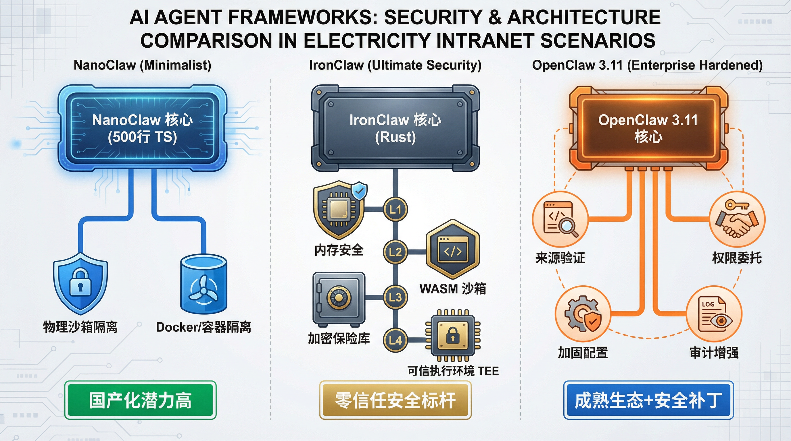
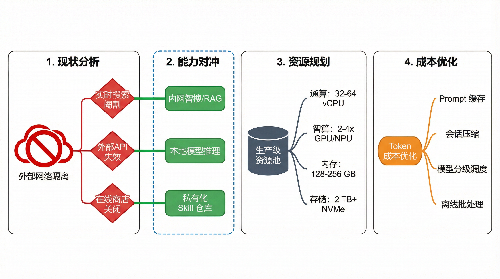

# OpenClaw 在电力内网部署的深度调研与方案建议

## 摘要

本报告针对电力行业客户在内网环境下部署 AI Agent 框架（特别是 OpenClaw 及其替代方案）所关心的核心技术问题、安全考量、国产化适配及资源优化等议题，进行了全面深入的调研与分析。本报告旨在为客户提供清晰的技术洞察、风险评估及可行的部署策略，以支撑其在电网智能化转型中的决策。

## 1. 核心问题提炼与调研概览

客户提出的问题集中在 OpenClaw 的架构优势、内网隔离下的能力边界、Skill 生态构建、国产化替代方案（NanoClaw）、安全加固（IronClaw 与 OpenClaw 最新版）以及资源与成本优化等方面。本报告将这些问题归纳为以下六个核心维度，并逐一进行深度解析。

## 2. NanoClaw 深度调研：国产化替代与极简安全架构

NanoClaw（港中文）以其**极简代码量（约 500 行 TypeScript）**和**物理沙箱隔离**的设计哲学，为高安全要求的内网环境提供了有力的国产化替代方案。其核心优势在于：

-   **高安全性**：每个智能体运行在独立的 Docker 容器或 macOS Apple Container 中，仅能访问明确挂载的目录，有效限制了潜在破坏力。
-   **低审计成本**：极小的代码量使得安全审计和功能定制变得非常容易，符合电力行业对软件可控性的要求。
-   **国产化适配潜力**：基于 Node.js 和 Docker 的特性，理论上可良好适配鲲鹏/飞腾 CPU 及麒麟/统信 OS。

然而，NanoClaw 的原生 Skill 生态相对较小，内网部署需要手动集成或开发特定 Skill，这在初期会带来一定的开发成本。

## 3. 安全加固专项调研：IronClaw 机制与 OpenClaw 3.11 (2026.3.11) 新特性分析

### 3.1 IronClaw：Rust 重构与四层纵深防御

由 Transformer 论文作者 Illia Polosukhin 发起的 IronClaw，旨在通过 **Rust 语言重构**，构建一个从语言到硬件的**四层纵深防御架构**：

1.  **Rust 内存安全**：从根本上消除缓冲区溢出等传统漏洞。
2.  **WASM 沙箱隔离**：所有工具和 AI 代码在独立的 WebAssembly 容器中运行，实现能力级权限控制。
3.  **加密凭证保险库**：API 密钥和密码使用 AES-256-GCM 加密存储，LLM 永远无法直接接触原始凭证。
4.  **可信执行环境 (TEE)**：利用硬件级隔离保护敏感数据，防止云服务商或宿主机管理员访问。

IronClaw 的设计理念与电力内网对**零信任安全**和**数据主权**的极致要求高度契合，尤其在防止凭证泄露和指令注入方面表现卓越。

### 3.2 OpenClaw 2026.3.11：企业级安全更新

针对工信部及国家互联网应急中心的安全预警，OpenClaw 社区于 2026 年 3 月 11 日发布了重大安全加固版本。核心更新包括：

-   **浏览器来源验证**：强制所有 WebSocket 连接进行来源校验，防御 CSRF。
-   **细粒度权限委托**：支持对 Skill 调用进行硬件级隔离和权限细分。
-   **默认加固配置文件**：默认禁用高风险操作，需显式开启。
-   **审计日志增强**：记录 AI 决策路径和系统资源调用，便于事后溯源。

**建议**：电力内网部署 OpenClaw 必须使用 2026.3.11 或更高版本，并严格遵循安全配置指南。

## 4. 内网隔离部署方案设计：Skill 迁移成本、资源需求与 Token 优化策略

### 4.1 内网隔离下的能力边界

在完全不连外网的电网内网，OpenClaw 的**实时网页搜索、外部 API 调用、在线 Skill 商店**等功能将被阉割。对冲方案包括：

-   **内网智搜**：对接企业内部知识库或内网搜索引擎。
-   **本地模型**：部署国产/开源大模型进行推理。
-   **离线 Skill 库**：私有化 Skill 仓库进行分发和版本控制。

### 4.2 Skill 迁移与重构成本

外网 Skill 迁移至内网需将外部 API 调用重定向至内网服务。针对电网特有协议的 Skill 开发，预计将占总开发量的 60%-70%。建议优先迁移通用型 Skill，核心业务 Skill 进行定制化二开。

### 4.3 资源需求规划

生产级 OpenClaw 部署（含本地模型推理）建议配置：

-   **通算 (CPU)**：32-64 vCPU (推荐 AMD EPYC 或鲲鹏)
-   **内存 (RAM)**：128-256 GB (ECC 内存)
-   **智算 (GPU/NPU)**：2-4x NVIDIA A10/L40 或昇腾 910B
-   **存储 (NVMe)**：2 TB+ (用于模型权重与向量数据库)

### 4.4 Token 消耗与成本优化

针对高 Token 消耗场景，可采用：

-   **Prompt 缓存**：减少重复系统提示词计算。
-   **会话压缩**：定期对长对话进行摘要压缩。
-   **模型分级调度**：简单任务调用轻量级模型，复杂任务调用旗舰模型。
-   **离线批处理**：非实时任务采用批处理模式。

## 5. 总结与建议

电力内网部署 AI Agent 框架面临独特的挑战，但通过选择合适的框架（如 NanoClaw 或安全加固后的 OpenClaw/IronClaw），并结合内网环境进行定制化开发与优化，完全可以实现安全、高效的智能化应用。建议客户：

1.  **优先考虑安全性**：在框架选型上，将 IronClaw 和 NanoClaw 的安全特性作为重要考量。
2.  **制定 Skill 国产化策略**：明确内网 Skill 的开发范式和迁移路径。
3.  **分阶段实施**：从试点项目开始，逐步验证技术方案和资源需求。

## 附件

-   [NanoClaw 深度调研报告](./nanoclaw_research/nanoclaw_deep_dive.md)
-   [IronClaw 安全加固专项调研报告](./ironclaw_security/ironclaw_security_deep_dive.md)
-   [OpenClaw 2026.3.11 安全更新调研报告](./openclaw_311_update/openclaw_311_security_update.md)
-   [内网隔离部署方案设计](./intranet_deployment_strategy/intranet_deployment_strategy.md)
