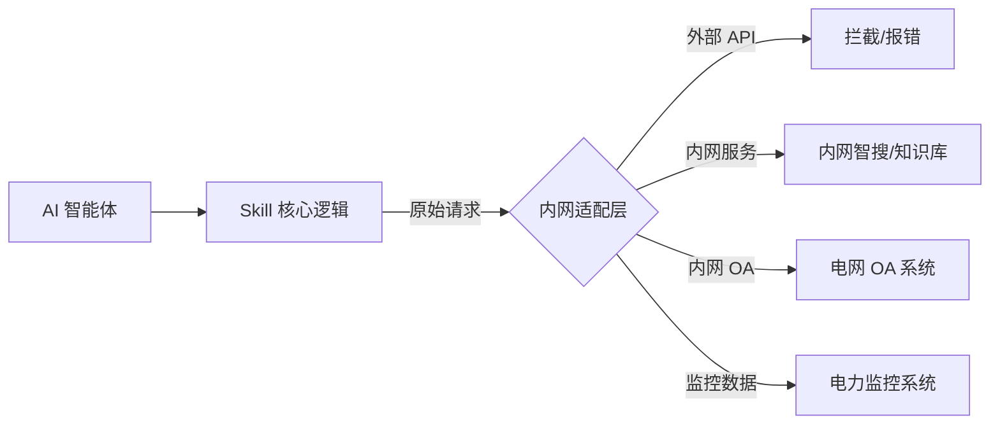

# 电力内网 Skill 适配：从外网 API 到内网 RAG 的代码实践

## 1. 核心挑战：外网 Skill 的“水土不服”
外网 Skill 大多依赖公网 API（如 Google Search, Slack API）。在电力内网隔离环境下，必须将这些调用重定向至内网服务。

## 2. 适配架构：Skill 代理模式 (Skill Proxy Pattern)
在内网部署时，我们不直接修改 Skill 的核心逻辑，而是通过一个**内网适配层**进行拦截和转发。



## 3. 核心代码块分析：内网 Skill 适配模板
以下是一个将“外网新闻搜索”适配为“内网智搜”的 Skill 模板示例（TypeScript）：

```typescript
// 核心逻辑：重写 Skill 的 fetch 或 API 调用方法
import { searchIntranetRAG } from './intranet-services';

export class IntranetNewsSkill {
  // 1. 原始 Skill 接口定义
  async searchNews(query: string) {
    // 关键点：检测环境，如果是内网环境，自动切换到内网智搜
    if (process.env.INTRANET_MODE === 'true') {
      console.log(`[Intranet Mode] Redirecting query: ${query} to internal RAG...`);
      
      // 2. 调用内网智搜服务 (RAG)
      const results = await searchIntranetRAG({
        query,
        topK: 5,
        namespace: 'power-grid-news'
      });

      // 3. 格式化为 AI 可理解的结构
      return results.map(item => ({
        title: item.metadata.title,
        content: item.pageContent,
        source: '电力内网智搜'
      }));
    }

    // 如果在外网环境，走原始逻辑 (此处仅为示例)
    throw new Error("EXTERNAL_NETWORK_BLOCKED: Intranet mode only.");
  }
}
```

### 技术干货点：
-   **环境感知 (`INTRANET_MODE`)**：通过环境变量动态切换执行逻辑，确保同一套 Skill 代码可以在开发环境（外网）和生产环境（内网）无缝切换。
-   **数据结构对齐**：内网 RAG 返回的数据必须经过格式化，使其与原始外网 API 的返回结构保持一致，从而不破坏 AI 的后续推理逻辑。

## 4. 电力内网二开建议
针对电网特有协议（如 IEC 61850），建议：
1.  **协议转换层**：开发一个通用的 `Protocol-Bridge` Skill，将复杂的电力协议（MMS/GOOSE）转换为 AI 易于理解的 JSON 格式。
2.  **安全脱敏层**：在 Skill 返回数据给 AI 之前，强制经过一个 `Data-Masking` 模块，自动过滤掉敏感的电网拓扑信息。
3.  **离线缓存**：对于高频访问的内网数据，在 Skill 内部实现 LRU 缓存，减少对内网核心数据库的压力。
