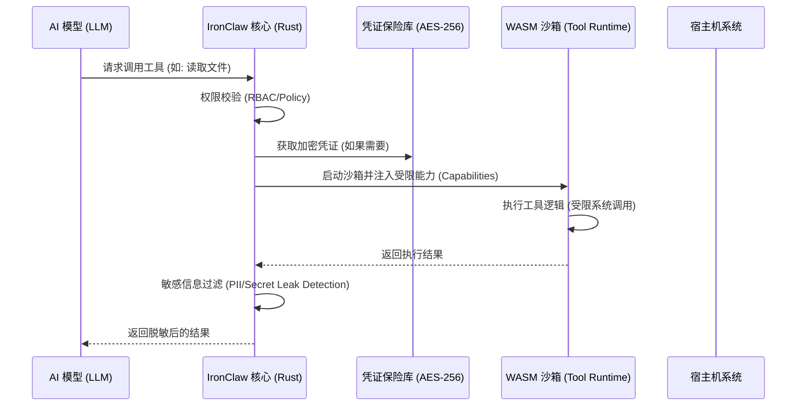

# IronClaw 安全架构深度解构：Rust + WASM 纵深防御

## 1. 核心技术栈：Rust 与 WebAssembly (WASM)
IronClaw 放弃了 OpenClaw 的 TypeScript 架构，转而使用 **Rust** 进行重构。其核心逻辑在于：
-   **Rust**：提供编译时内存安全，消除 C/C++ 常见的缓冲区溢出漏洞。
-   **WASM**：作为工具执行的沙箱，提供**能力级权限控制 (Capability-based Security)**。

## 2. 工具执行时序图 (Sequence Diagram)
在 IronClaw 中，一个工具（Skill）的调用不再是简单的函数执行，而是一个跨越安全边界的过程：



## 3. 核心代码块分析：WASM 沙箱初始化
以下是 IronClaw 中初始化 WASM 沙箱并注入能力的逻辑示例（Rust）：

```rust
// 核心逻辑：为工具创建一个受限的 WASM 运行环境
pub fn create_tool_sandbox(tool_id: &str, allowed_paths: Vec<PathBuf>) -> Result<WasmInstance> {
    let mut config = Config::new();
    config.wasm_multi_memory(true);
    
    let engine = Engine::new(&config)?;
    let mut linker = Linker::new(&engine);

    // 1. 注入受限的文件系统能力 (WASI)
    let mut wasi_builder = WasiCtxBuilder::new();
    for path in allowed_paths {
        // 关键点：显式指定只读或读写权限，且仅限特定目录
        wasi_builder.preopened_dir(path, "/sandbox", DirCaps::READ | DirCaps::WRITE)?;
    }
    
    // 2. 禁用网络访问 (默认行为)
    // wasi_builder.inherit_network(false); 

    let wasi_ctx = wasi_builder.build();
    let mut store = Store::new(&engine, wasi_ctx);

    // 3. 实例化并运行
    let instance = linker.instantiate(&mut store, &module)?;
    Ok(instance)
}
```

### 技术干货点：
-   **WASI (WebAssembly System Interface)**：IronClaw 利用 WASI 实现了对文件系统、网络、时钟等系统资源的精细化控制。
-   **能力注入**：工具在编译为 WASM 后，本身不具备任何系统访问权限。所有的权限（如访问 `/tmp/data`）都是在运行时由 Rust 核心显式“注入”的。

## 4. 电力内网安全加固建议
针对电网的高安全要求，IronClaw 的优势在于：
1.  **凭证隔离**：即使 AI 被诱导产生恶意指令，它也无法通过 WASM 沙箱窃取存储在 Rust 核心中的内网系统凭证。
2.  **确定性执行**：WASM 字节码的执行是确定性的，易于进行形式化验证和静态行为分析。
3.  **资源配额**：可以为每个 WASM 沙箱设置 CPU 指令数上限和内存上限，防止恶意指令导致内网服务器宕机。
