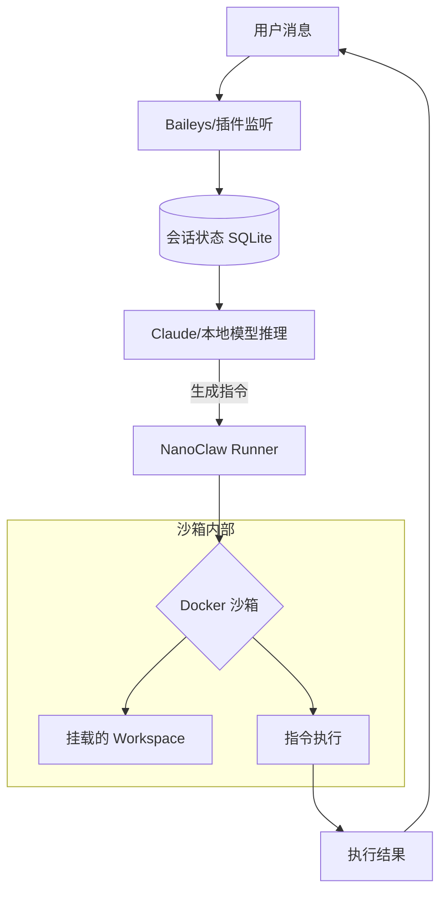

# NanoClaw 核心架构深度解构：500 行代码实现物理沙箱隔离

## 1. 核心设计哲学：约束效应而非意图 (Constrain Effects, Not Intent)
NanoClaw 的核心竞争力在于其极简主义。它不试图通过复杂的逻辑去理解 AI 的意图并进行权限拦截，而是直接将 AI 扔进一个**物理隔离的容器**中。即使 AI 产生了恶意指令，其破坏范围也被严格限制在容器内部。

## 2. 核心运行循环 (The Agentic Loop)
NanoClaw 的核心逻辑集中在约 500 行 TypeScript 代码中，其运行流程如下：
1.  **消息监听**：通过 `baileys` (WhatsApp) 或其他插件监听输入。
2.  **状态持久化**：使用 SQLite 记录会话上下文。
3.  **容器化执行**：调用 `Docker` 或 `Apple Container` 运行指令。

## 3. 核心代码块分析：容器化 Runner 实现
以下是 NanoClaw 实现物理隔离的核心逻辑伪代码（基于其开源架构分析）：

```typescript
// 核心隔离逻辑：为每个 Agent 启动独立的 Docker 容器
async function runInSandbox(agentId: string, command: string, workspacePath: string) {
  const containerName = `nanoclaw-agent-${agentId}`;
  
  // 1. 检查容器是否存在，不存在则创建
  // 关键点：只挂载必要的 workspace 目录，且设置为读写受限
  const dockerCmd = `
    docker run -d \
      --name ${containerName} \
      --network none \  // 默认禁用网络，防止数据外泄
      -v ${workspacePath}:/home/agent/workspace:rw \
      nanoclaw-base-image /bin/bash
  `;

  // 2. 在容器内执行 AI 生成的指令
  const { stdout, stderr } = await exec(`docker exec ${containerName} /bin/bash -c "${command}"`);
  
  return { output: stdout, error: stderr };
}
```

### 技术干货点：
-   **网络隔离 (`--network none`)**：这是电力内网最关注的特性。NanoClaw 默认可以完全切断 Agent 的网络访问，仅允许其处理本地挂载的文件。
-   **目录挂载 (`-v`)**：通过 Docker 的 `-v` 参数，实现了精确到文件夹级别的权限控制。Agent 无法看到宿主机的任何其他文件。

## 4. 物理隔离流程图 (Mermaid)



## 5. 电力内网二开建议
针对电网国产化要求，建议在 `runInSandbox` 函数中：
1.  将 `docker` 替换为国产容器引擎（如 `iSulad`）。
2.  在挂载目录时，引入 `OverlayFS` 进行写时复制（COW），确保 Agent 无法永久修改核心模板文件。
