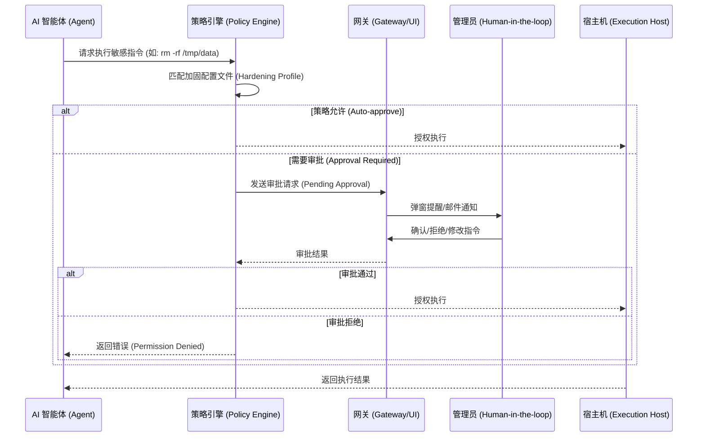

# OpenClaw 3.11 权限委托与审批流深度解构

## 1. 核心机制：权限委托 (Permission Delegation)
OpenClaw 3.11 引入了基于策略的权限委托机制。其核心逻辑是：**Agent 不再拥有静态权限，而是根据当前任务上下文动态申请授权。**

## 2. 权限审批时序图 (Approval Flow)
在 OpenClaw 3.11 中，涉及敏感操作（如 `system.run`）的指令必须经过以下审批流：



## 3. 核心代码块分析：`exec` 审批拦截逻辑
以下是 OpenClaw 3.11 中处理 `system.run` 审批的核心逻辑示例（TypeScript）：

```typescript
// 核心逻辑：拦截敏感指令并触发审批流
async function handleExecRequest(command: string, context: ExecutionContext) {
  const policy = await loadHardeningProfile(context.agentId);
  
  // 1. 静态规则检查
  if (policy.isBlacklisted(command)) {
    throw new Error("SYSTEM_RUN_DENIED: Command is blacklisted");
  }

  // 2. 动态审批判断
  if (policy.requiresApproval(command)) {
    // 关键点：挂起当前 Agent 任务，进入等待状态
    const approvalId = await createApprovalRequest({
      command,
      agentId: context.agentId,
      reason: "Sensitive system command detected"
    });

    // 3. 轮询或等待 WebSocket 回调
    const result = await waitForUserApproval(approvalId);
    
    if (result.status !== 'APPROVED') {
      throw new Error(`SYSTEM_RUN_DENIED: User rejected the command: ${result.reason}`);
    }
    
    // 如果用户修改了指令，使用修改后的指令执行
    command = result.modifiedCommand || command;
  }

  // 4. 最终执行
  return await actualExec(command);
}
```

### 技术干货点：
-   **挂起机制**：OpenClaw 3.11 能够保存 Agent 的完整状态（State Snapshot），在等待人工审批期间不占用活跃算力资源。
-   **指令修改**：管理员不仅可以拒绝，还可以**在线修改** AI 生成的指令（例如：将 `rm -rf /` 修改为 `rm -rf /tmp/test`），这在电力内网调试阶段非常实用。

## 4. 电力内网部署建议
针对电网对“可控性”的要求，建议：
1.  **强制开启 `SYSTEM_RUN_DENIED`**：将所有涉及文件修改和网络配置的指令设为“必须审批”。
2.  **集成内网 OA 审批**：通过 OpenClaw 的 Webhook 接口，将审批请求对接到电网现有的 OA 或运维管理系统。
3.  **审计日志脱敏**：在记录审计日志时，自动识别并脱敏电网敏感资产名称（如变电站 ID）。
