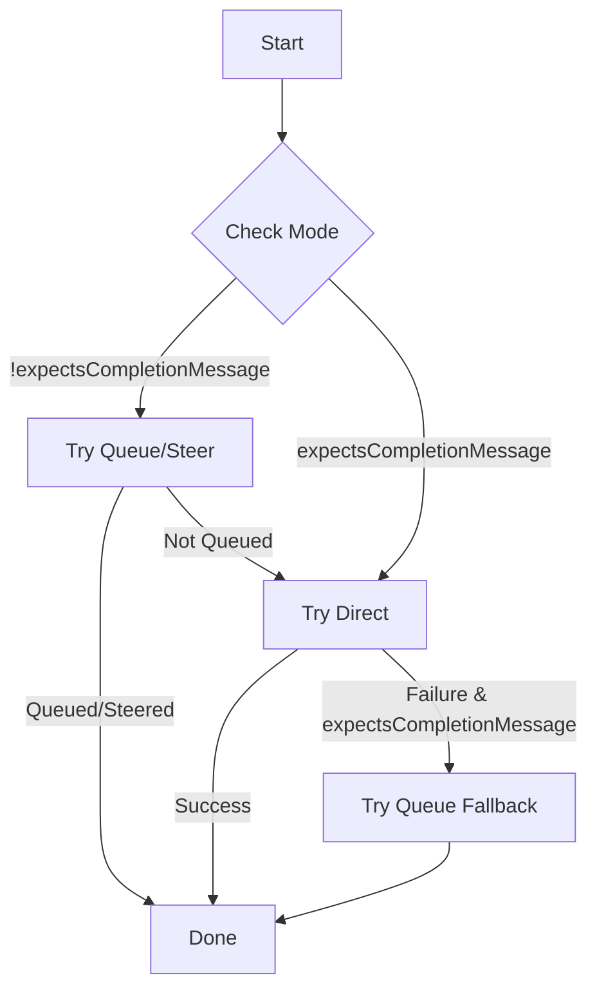

# OpenClaw v2026.2.25 深度技术调研报告

**版本**: v2026.2.25
**发布日期**: 2026年2月25日
**作者**: Manus AI (Damon Li)
**报告日期**: 2026年2月26日

---

## 1. 核心摘要 (Executive Summary)

OpenClaw v2026.2.25 是一次以**安全加固**和**核心架构重构**为主题的里程碑式更新。本次发布引入了纵深防御安全模型，全面覆盖了从 Gateway 认证、文件系统访问到跨平台通道交互的各个层面。其中，针对符号链接（Symlink）、硬链接（Hardlink）的路径逃逸攻击防护，以及对 `system.run` 执行审批流程的精细化重构，是本次安全更新的最大亮点。

在架构层面，**Subagent 完成通知分发机制被重构为显式的 `queue/direct/fallback` 状态机**，显著提升了高并发和异常场景下消息传递的可靠性。同时，模型故障转移（Failover）逻辑也得到大幅增强，能够更智能地处理 `rate_limit`、`cooldown` 和永久性认证失败等情况，提高了系统的整体韧性。

此外，版本还包含对 Android 客户端性能、多平台（Telegram, Slack, Discord 等）功能修复和可用性的大量改进。值得注意的是，本次更新包含一个重大变更：Heartbeat 的 `directPolicy` 默认值被重置为 `allow`，需要管理员关注并按需调整配置。

## 2. 核心架构变更：Subagent 完成通知状态机

v2026.2.25 最重要的架构变更是将 Subagent 的完成通知分发（Completion Announce Dispatch）逻辑重构为一个显式的三路状态机，解决了此前在冷启动、插件注册表过期等边缘场景下消息投递不稳定的问题 [1]。

该状态机在 `deliverSubagentAnnouncement` 函数中实现，根据通知类型（是否为手动完成消息）选择不同的执行路径，确保消息的可靠投递。

| 模式 | 触发条件 | 路径 | 描述 |
| :--- | :--- | :--- | :--- |
| **完成通知** | `expectsCompletionMessage: true` | `Direct` → `Fallback to Queue` | 优先尝试直接投递；若失败，则回退到队列中等待下一次处理。 |
| **非完成通知** | `expectsCompletionMessage: false` | `Queue/Steer` → `Direct` | 优先尝试入队或转向（Steer）；仅在无法入队时才尝试直接投递。 |

为了防止重复投递，系统通过 `buildAnnounceIdempotencyKey` 生成确定性的幂等键，并在 `direct` 和 `queued` 路径间共享，使得 Gateway 能够有效去重。

*图 1: Subagent 完成通知分发状态机流程图*

通道解析方面，`resolveAnnounceOrigin` 函数会合并 `requesterOrigin`（在 Subagent 创建时捕获）和会话中存储的投递上下文，并优先采用前者，以避免因 `lastChannel` 或 `lastTo` 过期而导致的投递失败。最终解析出的通道、目标、账户ID等信息被传递给 Gateway，由其内部的插件注册表完成到具体通道插件的路由 [1]。

## 3. 全方位安全加固 (Comprehensive Security Overhaul)

本次更新的绝大部分内容都集中在安全加固上，构建了一个多层次的纵深防御体系。

### 3.1. Gateway 认证与设备配对

Gateway 的认证系统被重构为一个分层模型，v2026.2.25 对其进行了大幅强化，核心目标是确保只有经过明确授权的设备和用户才能访问 Gateway [2] [3]。

- **强制设备配对**: 即便客户端使用共享的 `token` 进行认证，也必须先完成设备配对才能获得 `operator` 权限。这杜绝了仅凭泄露的 token 就能获得高级权限的风险。
- **WebSocket 安全强化**: 对所有来源的 WebSocket 连接强制执行 `Origin` 检查，并对密码认证失败（包括来自 `localhost` 的尝试）应用节流策略，有效防止跨源 WebSocket 劫持和暴力破解攻击。
- **可信代理安全**: `trusted-proxy` 模式下的配对绕过现在要求客户端必须具备 `operator` 角色，防止未配对的节点伪装成 `control-ui` 来调用内部事件。

### 3.2. 文件系统访问控制

针对利用文件系统链接进行路径逃逸的攻击，新版本增加了严格的防护措施 [4]。

- **Symlink 防护**: `agents.files.get/set` 等工具现在会严格检查并阻止指向 workspace 目录之外的符号链接目标。
- **Hardlink 防护**: `tools.fs.workspaceOnly` 和 `tools.exec.applyPatch.workspaceOnly` 的边界检查现在能够识别并拒绝使用硬链接创建的 workspace 外文件别名。
- **路径规范化**: 对浏览器下载、追踪等产生的临时文件路径，强制使用 `realpath` 进行检查，并对不安全的 fallback 目录采取失败关闭策略，彻底封堵了通过符号链接进行写操作的逃逸路径。

### 3.3. `system.run` 执行审批

命令执行审批机制得到了精细化重构，以防止在审批和执行之间通过路径操纵绕过安全策略 [4]。

- **精确 argv 绑定**: `system.run` 的审批现在与命令的 `argv`（参数列表）精确绑定，并且保留其中的空白字符。这可以防止攻击者通过在可执行文件路径后添加空格等方式来重用一个不相关的审批项。
- **CWD 与 Symlink 防护**: 在 Node.js 主机上执行命令时，系统会拒绝符号链接的 `cwd`（当前工作目录）路径，并在 `spawn` 前对类路径的 `argv` 参数进行规范化，从而阻止在审批和执行的间隙通过修改 `cwd` 符号链接目标来执行非预期命令的攻击链。

### 3.4. 多平台通道授权

新版本将授权检查扩展到了非消息事件，如 Reaction、Pin 等，确保了所有输入途径的权限一致性 [5]。

| 平台 | 安全增强措施 |
| :--- | :--- |
| **Signal** | 在 Reaction 通知入队前，强制执行 DM/Group 授权检查。 |
| **Discord** | Reaction 事件和 Component Interaction（如按钮点击）现在强制遵循 DM/Group 策略。 |
| **Slack** | Reaction 和 Pin 事件现在通过共享的发送者授权逻辑进行门控；Block Kit Interaction 也强制执行通道/DM授权和 Modal Actor 绑定。 |
| **Telegram** | Reaction 事件强制执行 `dmPolicy/allowFrom`；Group 的 `allowlist` 授权不再回退到使用 DM 配对存储。 |

## 4. 模型韧性与故障转移增强

模型故障转移（Failover）系统得到了显著增强，使其在面对各种 API 异常时更具韧性 [6]。

- **错误分类与处理**: `classifyFailoverReason` 函数现在能更精确地识别错误类型。`model_cooldown` 或 `cooling down` 等原本未明确处理的错误现在被统一归类为 `rate_limit`，从而能够触发指数退避和后续的 fallback 流程。
- **Fallback 链增强**: 即使配置了全局的 `agents.defaults.models` allowlist，显式定义的 `text` 和 `image` fallback 链依然保持可达。当会话中使用的模型与配置的主模型不同时，同提供商的 fallback 链也会保持活跃。
- **智能 Cooldown 推断**: 系统现在会从 `provider profile` 的状态（而不仅仅是 `disabledReason`）来推断 Cooldown 的原因，使得决策更加精准。
- **永久性失败处理**: 对于因密钥吊销等导致的永久性认证失败，`openclaw models status --probe` 现在能报告为可操作的 `auth_permanent` 状态，而不是之前的 `unknown`。

## 5. 配置与可用性改进

- **Heartbeat `directPolicy`**: v2026.2.24 中引入的用于控制 Heartbeat 是否能发送 DM 消息的 toggle 被替换为更明确的 `agents.defaults.heartbeat.directPolicy` 配置项，可选值为 `allow` 或 `block`。**注意：此版本的默认值已从 `block` 改回 `allow`** [5]。
- **Android 性能与体验**: 针对 Android 平台的启动性能进行了优化（延迟前台服务、移出 WebView 调试初始化），并改进了原生聊天 UI 中的 Markdown 渲染质量，更好地支持 GFM (GitHub-Flavored Markdown)。

---

## 6. 参考文献

[1] DeepWiki. *Subagent Completion Announce Dispatch State Machine*. (2026-02-26).
[2] DeepWiki. *Gateway Authentication System*. (2026-02-26).
[3] OpenClaw Docs. *Gateway Protocol*. (2026-02-20).
[4] DeepWiki. *OpenClaw Security Model*. (2026-02-26).
[5] DeepWiki. *Heartbeat Delivery and Channel Authorization*. (2026-02-26).
[6] DeepWiki. *Model Selection and Failover System*. (2026-02-26).
